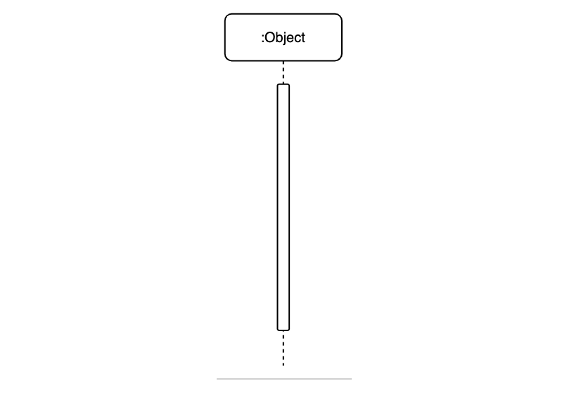

<!--_color: #2EFE64 -->
# 클래스 명세서

---

# Sequence diagram
(시퀀스 다이어그램)

---

## index

* 개념
* 용어(부연설명)

---

### 개념
* 특정 행동이 어떠한 순서로 어떤 객체와 어떻게 상호작용을 하는지 표현하는 행위 다이어그램
*  API 등의 유즈 케이스를 디테일하게 알 수 있고 타 시스템의 API 호출 등의 로직을 모델링할 수 있어 시나리오를 쉽게 파악해주는 프로그램
* {API란? Application Programming Interface(애플리케이션 프로그램 인터페이스)의 줄임말으로 프로토콜 집합을 사용하여 두 소프트웨어 구성 요소가 서로 통신할 수 있게 하는 메커니즘}
* (https://brownbears.tistory.com/511)[시퀀스 다이어그램 개념]
* (https://aws.amazon.com/ko/what-is/api/)[API의 부연설명]

---

### 용어
# Lifeline(라이프 라인)

 
*  네모와 점선으로 이루어져 있으며 네모가 객체의 관점으로 표현했다면 클래스
* 서비스 관점으로 표현했으면 컴포넌트가 되며 점선은 시간의 경과를 나타남

---

# Activation(활성화)

*  Lifeline의 인스턴스가 다른 인스턴스와 상호 작용을 하며 활성화 되어 있는 것을 나타남
* 직사각형의 막대로 Lifeline의 점선 가운데에 표시

---

# Message(메세지)
* 메시지는 인스턴스(instance) 간 주고 받은 데이터를 나타냄
* {인스턴스:  일반적으로 실행 중인 임의의 프로세스, 클래스의 현재 생성된 오브젝트를 가리킴} 
[https://ko.wikipedia.org/wiki/%EC%9D%B8%EC%8A%A4%ED%84%B4%EC%8A%A4]
* 일반적으로 요청과 응답 (HTTP 통신 기준)으로 나타남

---

# Message 유형

---
# Message 유형설명
## 동기 메세지(Sync message)

* 선과 꽉 찬 화살표로 표현
* 요청을 보낸 후, 결과가 올 때까지 기다림

---
## 비동기 메세지(Async message)

* 요청을 보낸 다음 반환을 기다리지 않고 다른 작업을 수행
* 요청을 보낸 후, 결과를 기다리지않음

---

## 자체 메시지(Self message)

* 자기 자신에게 요청을 보냄
* 자체적으로 작업을 처리할 때, 자체 메시지를 사용
* 본인의 Lifeline으로 회귀하는 화살표를 그림

---

## 반환 메시지(Reply/Prturn message)

* 요청에 대해 메세지 반환
* 동기 메시지에서 표현했던 것과 같이 요청에 대한 결과를 반환
* 점선과 선으로 이뤄진 화살표로 표현
---
# 흐름 제어(Flow Control)
* 시퀀스 다이어그램을 그림을 좀 더 프로그래밍적인 표현을 설명 

* if, for, while과 같은 흐름을 제어하는 표현을 시간 순으로 인스턴스 간 상호작용을 표현하기 때문에 흐름을 제어하는 표현들이 필요하다는 것 
* 여기서 사용요소가 Guard와 Sequence Fragment 있음

---

# Guard(가드)

* 단일 메시지에 대해 조건을 명시할 수 있는 방법
* 메시지의 앞 쪽에 [ ] 대괄호로 감싼 후 조건을 명시
* eX) 가격이 10,000원 이상이라고 하면 [price > 10000]이라고 명시 아래는 가격이 10000원 이상이라면 배송비를 무료로 처리하도록 하는 예시이며, 만약 가격이 10000원 미만이면 해당 메시지는 호출되지 않음

---
# Sequence Fragment(시퀀스 조각)
* 다이어그램의 일부 위에 그려진 사각형 프레임
* 메시지 흐름에 영향을 미치는 조건부 구조를 나타남
* 범위로 조건을 명시
* 특정 부분에 대해서 메시지를 반복하거나 조건을 명시할 때 사용

---

# alternative[대체 조각]

* alternative는 alt로 줄여서 사용
* alt는 조건문인 if/else문을 Guard를 사용해 표현가능
* 조건에 따라 선택 사항이 여러 개일 경우 사용

---

* 조건에 따라 선택 사항이 여러 개일 경우 사용 아래는 가격이 10000원 이상이면 배송비를 무료로 처리하고 그렇지 않으면 배송비를 유료로 사용하는 것을 표현한 예시

---
# option(옵션)

* option은 opt로 줄여서 사용
* opt는 조건문인 if문을 Guard를 사용해 표현

----

* 가격이 10000원 이상이라면 배송비를 무료로 처리하고 고객이 추가 할인 쿠폰을 요청한 다음 쿠폰을 제공하는 예시 (만약 가격이 10000원 미만이라면 해당 로직을 타지 않음)
* [opt를 보면 Guard만 사용한 것과 유사해보임 opt를 사용했는데 처리하는 내용이 1개라면 Guard와 동일한 효과를 나타남 두 개의 차이는 Guard는 'A라면 B한다.' 와 같이 1개에 대해 1가지의 결과를 보여주는 반면, opt는 'A라면 B도 하고 C도 하고 D도 하고 등등을 한다.' 와 같이 1개에 대해 여러 결과를 나타낼 수 있음]

---
# option 조건
* 보호 조건(A guard condition): UML의 가드를 사용하면 옵션을 활성화하기 전에 온라인 상점의 제품이 선물 포장에 적합한지 여부와 같은 특정 조건이 충족되었는지 확인할 수 있습니다.
* 가드 조건(guard condition): 조각 프레임 상단의 대괄호 안에 표시됩니다. 일반적으로 true 또는 false에 해당하는 부울 식이지만 루프 조각의 경우 나중에 살펴보겠지만 더 복잡할 수 있습니다.
----

# loop(루프)
* loop은 단어 의미 그대로 for, while과 같은 반복문을 표현

*  입력된 시간이 2020-08-01보다 작을때 반복문을 실행하고 그 하위 조건으로 처리를 하는 예시

---

# parallel(평행)
* parallel은 단어 그대로 병렬 처리를 의미하며 par로 줄여서 사용

* 품 주문이 들어왔을 때, 상품 확인과 배송 여부 확인을 병렬로 진행하는 것을 표현한 예시

----
