<!--_color: orange -->
# TTS프로그램 다운로드 

---

# TTS 사용 프로그램(무료)

타임케스트
프로소디
클로바 더빙

---
## 타입캐스트
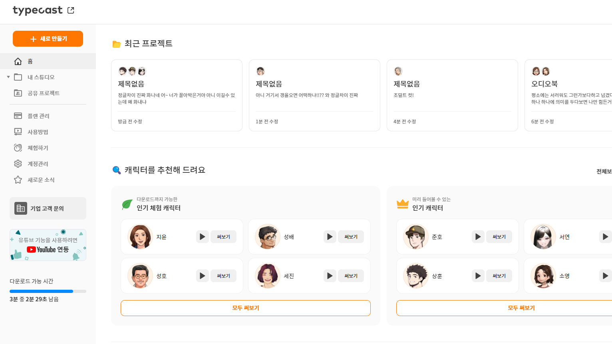

---
 #### 분석
 성우캐릭터 | 다운로드가능횟수(시간) | 음질설정여부 
:-----:|:------:|:----|
360개| 3분 | 불가     

---
 #### 다운로드 방법
 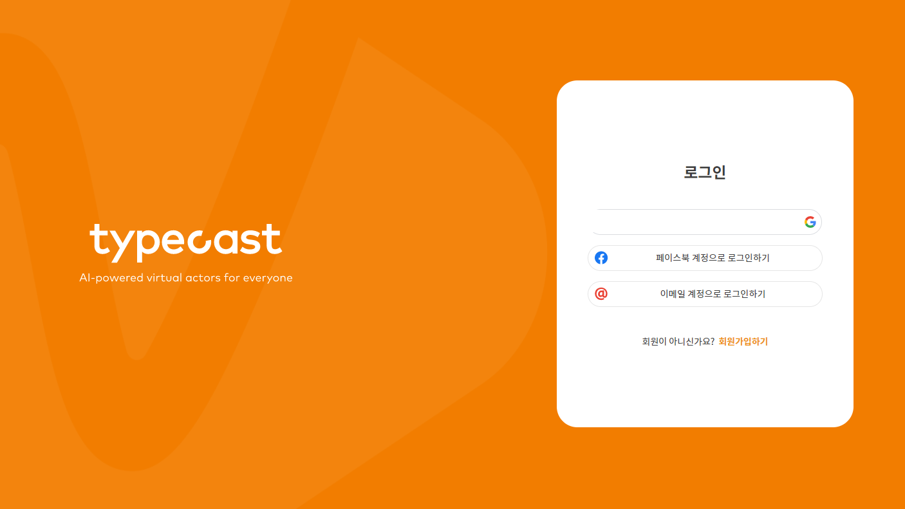
 - 로그인을 한 후 

 ---
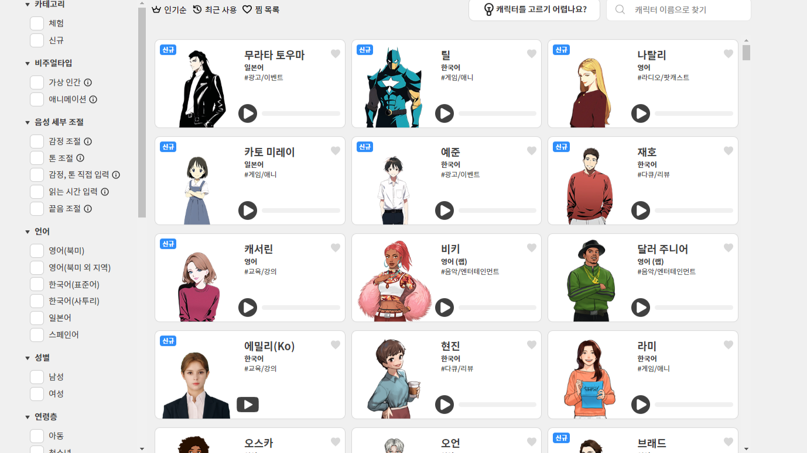
- 자신이 원하는 캐릭터를 선택
(종류는 다양하나 무료플랜에서 사용 할 수있는 
한정적으로 제공된 캐릭터만 다운로드 가능)
---

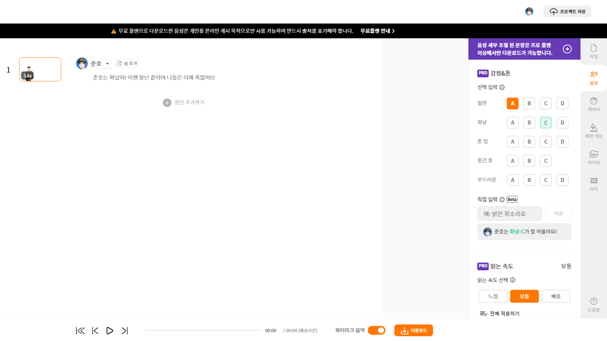
- 대사 입력 후 다운로드 클릭
(효과를 넣을려면 유료플랜을 사용해야함)

---

- 대사 입력 후 다운로드 클릭
(효과를 넣을려면 유료플랜을 사용해야함)

---

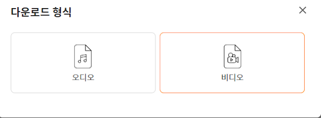
- 원하는 형식으로 다운로드 
(다운형식을 선택하면 음질설정이 나오지만 무료플랜은 선택불가)

---

- 원하는 형식으로 다운로드 
(다운형식을 선택하면 음질설정이 나오지만 무료플랜은 선택불가)

---
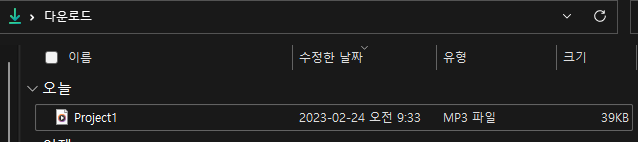
- 이런식으로 파일로 다운로드할 수 있다.
(추가로 다운로드 가능한 시간이 3분이니 참고하고 
영상에 쓰일거면 출처를 남길 것)

---
# 프로소디 

---

 #### 분석
 성우캐릭터 | 다운로드가능횟수(시간) | 음질설정여부 
:-----:|:------:|:----|
13개| 글자수로4000자 | 사용가능 

---

### 다운로드법

자신이 원하는 캐릭터(성우)를 고른 후 문단 추가 클릭

---

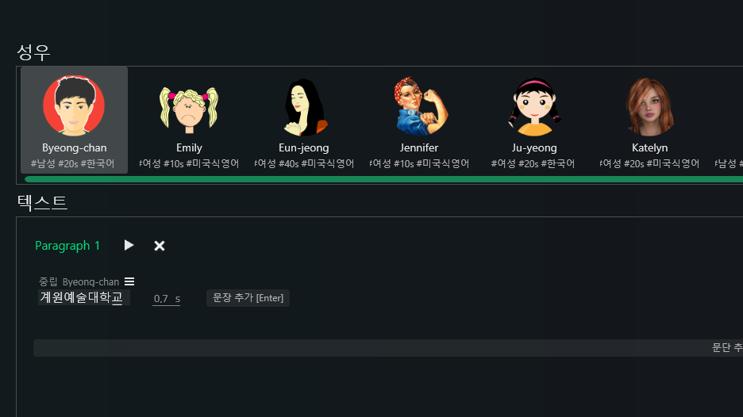
- 본인이 넣고싶은 문장을 삽입 후 

---

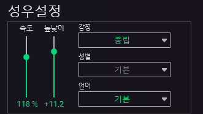
-우측 위에 성우설정에서 속도와높낮이감정옵션
설정이 필요하면 쓸 것 

---
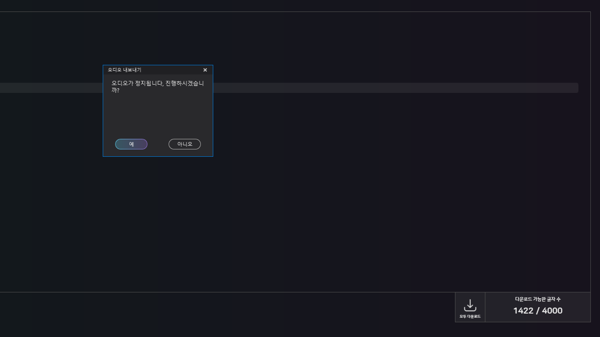
- (모두) 다운로드 클릭 후 

---

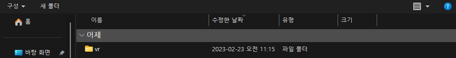
- 원하는 위치에 다운로드 후 확인  

---

# 클로바 더빙
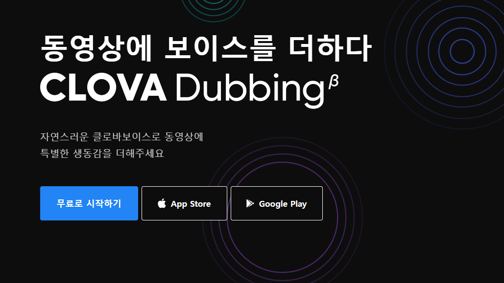

---

#### 분석
 성우캐릭터 | 다운로드가능횟수(시간) | 음질설정 
:-----:|:------:|:----:|
292개| 글자수15000개다운로드20회 | 불가 

----

### 다운로드법
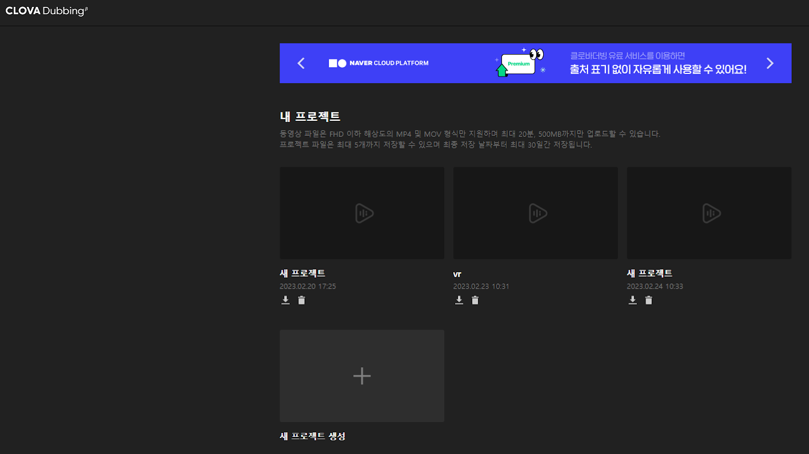
* 클로바 더빙에 들어가 로그인(네이버)후 새프로젝트 생성

---
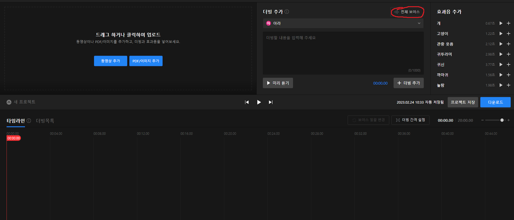
* 생성후 전체 보이스를 눌러 자신이 원하는 보이스캐릭터를 선택

---
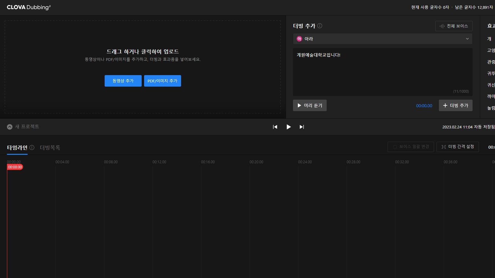
* 캐릭터 생성 후 더빙할 내용 입력
---
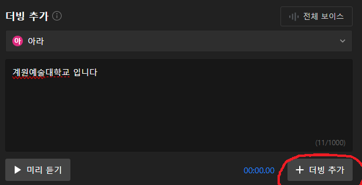
* (클릭전 미리 듣기 테스트) 더빙추가 클릭

---

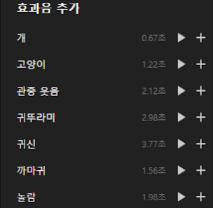
* (추가로 여러가지 효과(강아지,박수등등)를 넣을 수 있으니 참고)

---
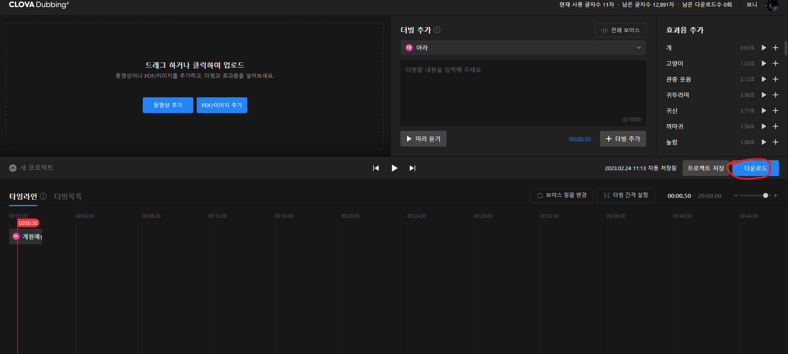
* 더빙추가 후  다운로드

---
* MP3,WMV둘중 하나 선택후 다운로드 

