# Unity 버전 설치

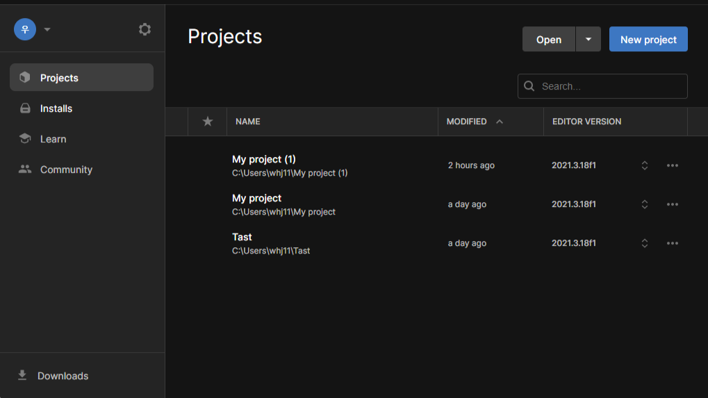 

<!--h 높이조절 -->

Installs 누르기

---

 
installs Editor 누르기

---

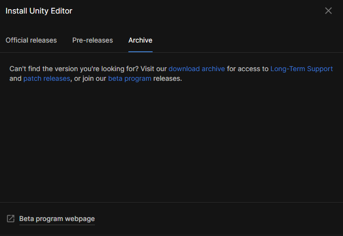
Archive를 눌러 Long-Term Support 눌러준다

 ---
 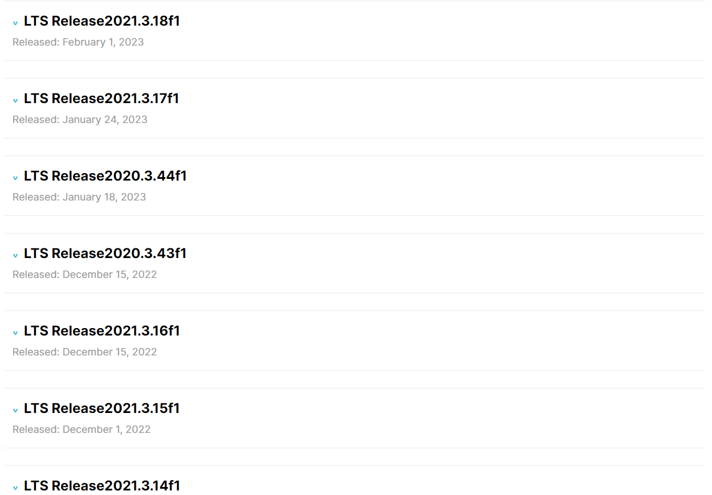
 웹사이트에 들어갔으면 아래로 내려와 자신이 찾는 버전을 누른다

 
 ---
 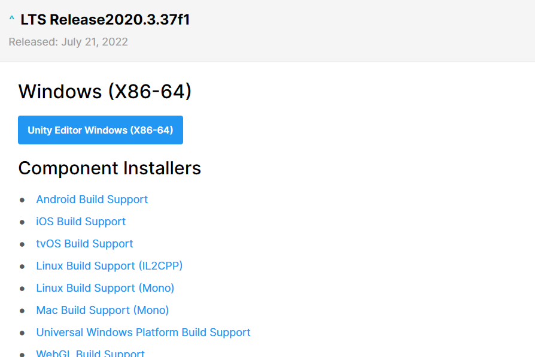
 Editor를 눌러준다 (참고로 맥북같은 경우 아래로 내리면 보인다)

 ---
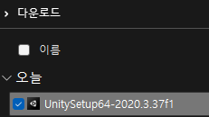
다운로드 폴더에 들어가 실행시킨다.

 ---

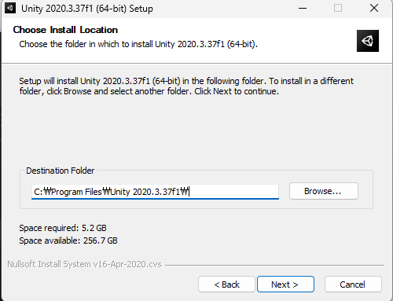
설치중간에 자기 파일 위치는 어디있는지 알아야할 것

 ---
 
 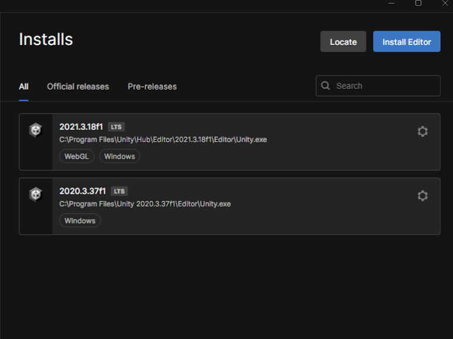
Locate를 눌러

 ---
 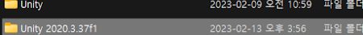
 파일을 찾은 후 

 ---
  
  유니티를 눌러  select Editor 를 클릭

  ---
  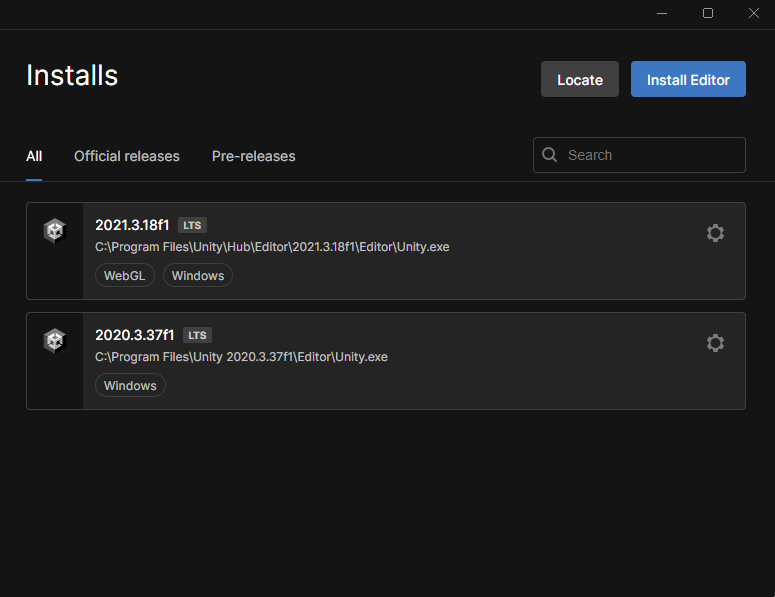
  그럼 설치가 완료 된 것을 확인할 수 있음

  ---

  # Dialogue
 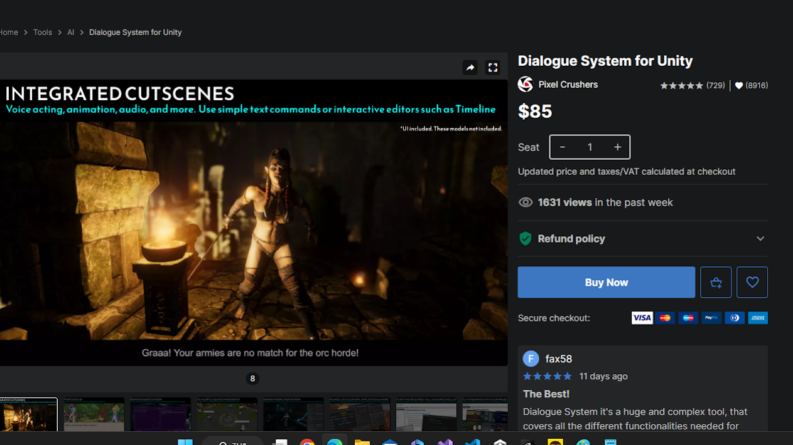
* window-asset store-Dialogue검색-Buynow 후 import

---
 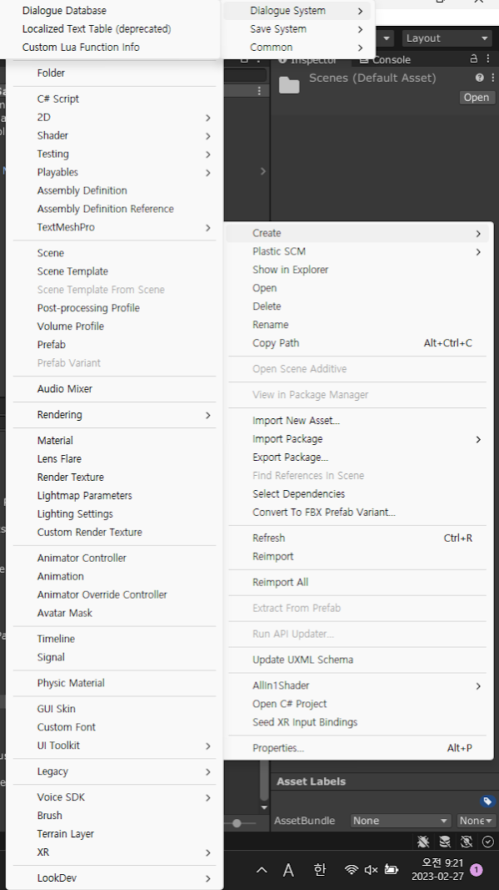
- imsport한 후 project창에 빈 곳을  오른쪽 마우스를 클릭 create 클릭 후 맨 위에 있는 pixelcrushers 클릭 후  Dialougue Syteam 클릭 후 Dialouge Database클릭

---

 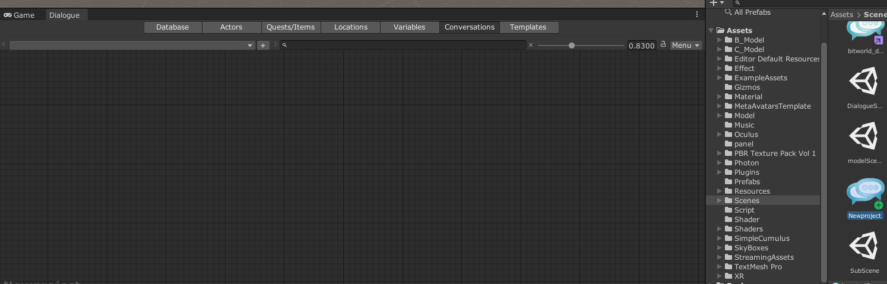
 - 만든 Dialouge Database를 더블클릭 후 Dialouge창을 game에 옮기고 Conversations 선택

---

  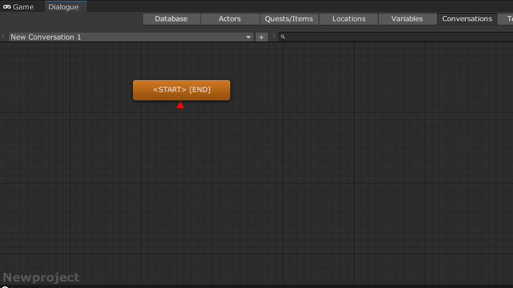
  -  (+) 버튼을 눌러 New Conversation 1를 생성

---

 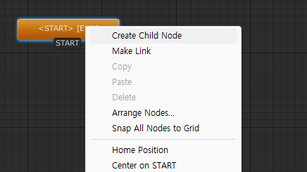
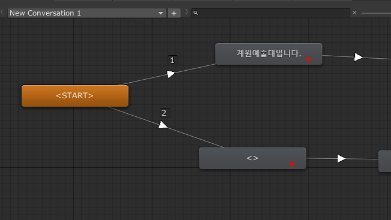
 -  start 오른쪽 마우스 클릭 후 Create Child Node 클릭 node 생성

 ---
  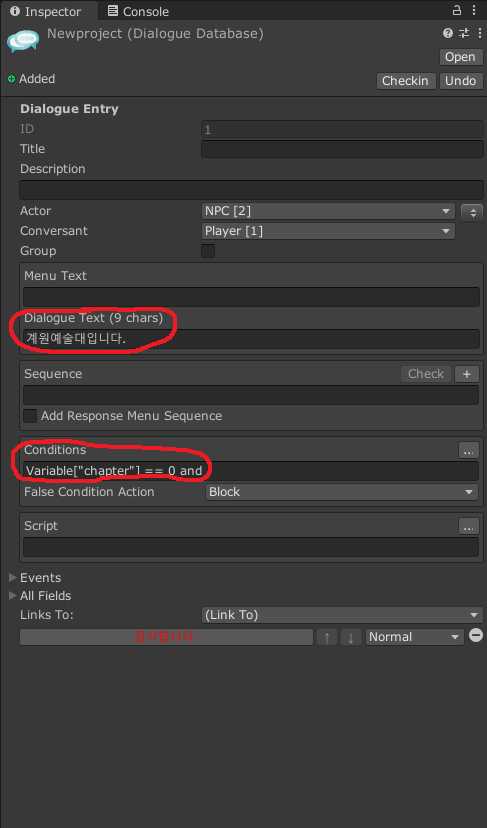
 -  Dialouge Text 입력 후 conditons에는 순서를 넣을 것 
 - conditons에서는  Variable["chapter"] == 0 and  기입
 - < start>를 시작 기점으로 변수 숫자는 0부터 시작해 0부터 넣을 것 
 

 ---
 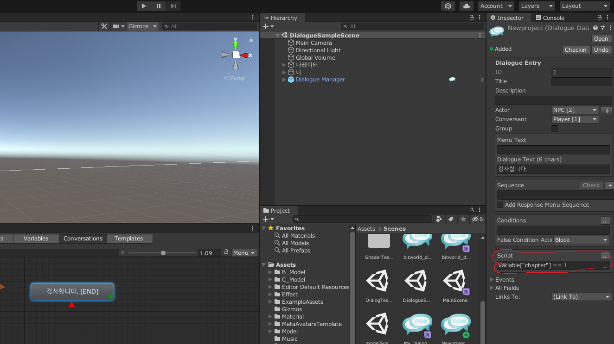
- node[END] 부분에서 다음 Node로 이동하기위해선
- script에서 Variable["chapter"] == 1  기입
- 플레이 버튼을 눌러 테스트 해볼 것 

---
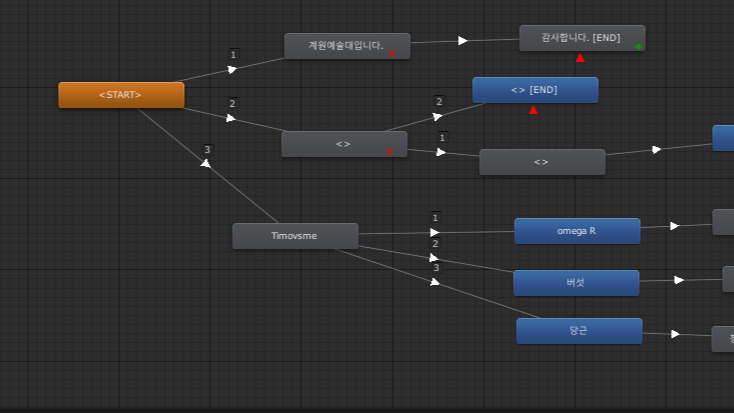
* Conversations를 제작하다 복잡하게 배치할때

---

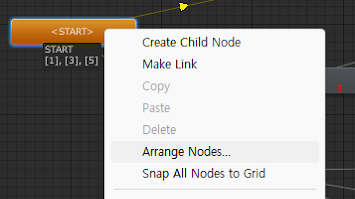
* < start>에오른쪽 마우스를 눌러 Arrange Nodes를 클릭

---
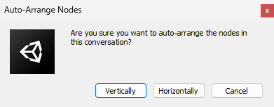
* Vertically(가운대 배치), Horizontally(좌쪽으로 배치)선택하여 클릭

----
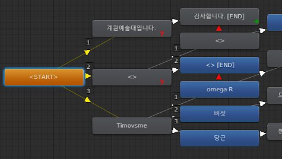

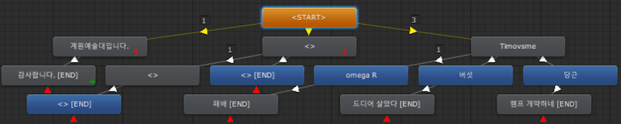
이런식으로 배치가 가능

