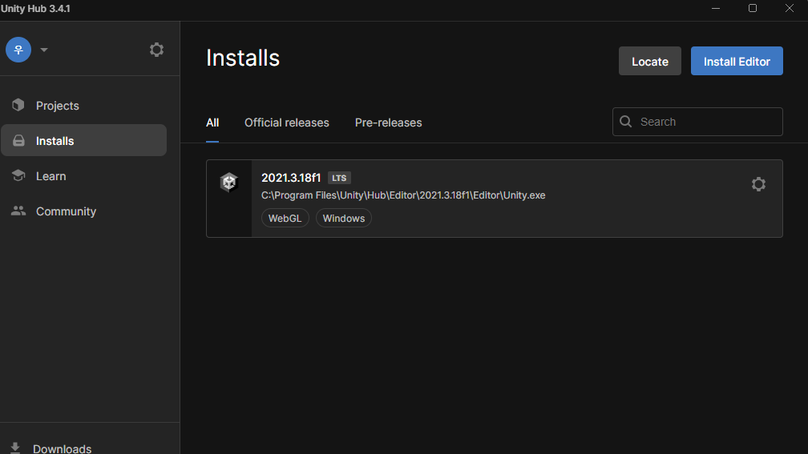
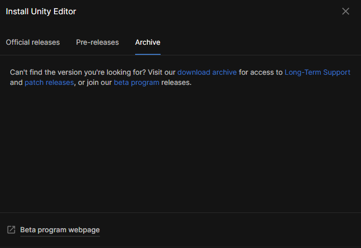
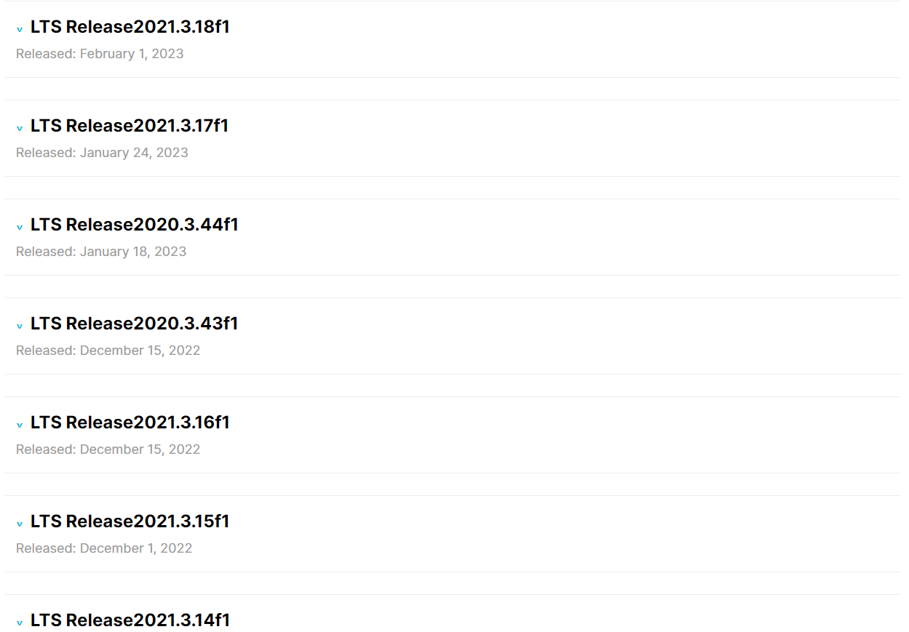
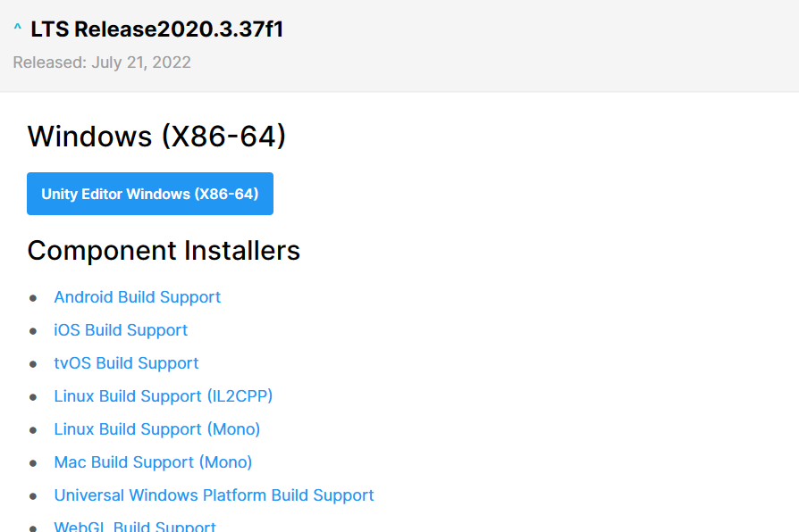

# Unity 버전 설치

 

<!--h 높이조절 -->

Installs 누르기

---

 
installs Editor 누르기

---

Archive를 눌러 Long-Term Support 눌러준다

 ---
 
 웹사이트에 들어갔으면 아래로 내려와 자신이 찾는 버전을 누른다

 
 ---
 
 Editor를 눌러준다 (참고로 맥북같은 경우 아래로 내리면 보인다)

 ---

 ---