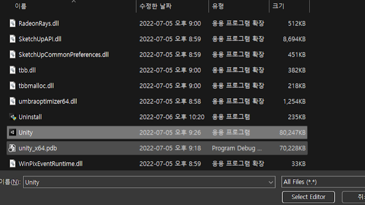

# Unity 버전 설치

 

<!--h 높이조절 -->

Installs 누르기

---

 
installs Editor 누르기

---

Archive를 눌러 Long-Term Support 눌러준다

 ---
 
 웹사이트에 들어갔으면 아래로 내려와 자신이 찾는 버전을 누른다

 
 ---
 
 Editor를 눌러준다 (참고로 맥북같은 경우 아래로 내리면 보인다)

 ---

다운로드 폴더에 들어가 실행시킨다.

 ---

설치중간에 자기 파일 위치는 어디있는지 알아야할 것

 ---
 
 
Locate를 눌러

 ---
 
 파일을 찾은 후 

 ---
  
  유니티를 눌러  select Editor 를 클릭
  ---
   