# 오큐러스와 PC(Unity)연결

---

# 목차* 
* 오큘러스 웹다운로드
* PC와 연결
* Quest link 나가는법
* Hand Tracking 활성화 (자동,수동)
* Oclus로 스크린샷 찍기
* pc화면으로 Oclus화면 스크린샷
* 공장초기화법

---
### 오큘러스 웹다운로드
 
오큐러스를 사용하기 위해 오큐러스 웹을 다운로드한다.
https://www.oculus.com/download_app/?id=1582076955407037

---
 
다운로드를 마치고 로그인을 진행한다 
(feacbook, instargram)

---
# PC와 연결
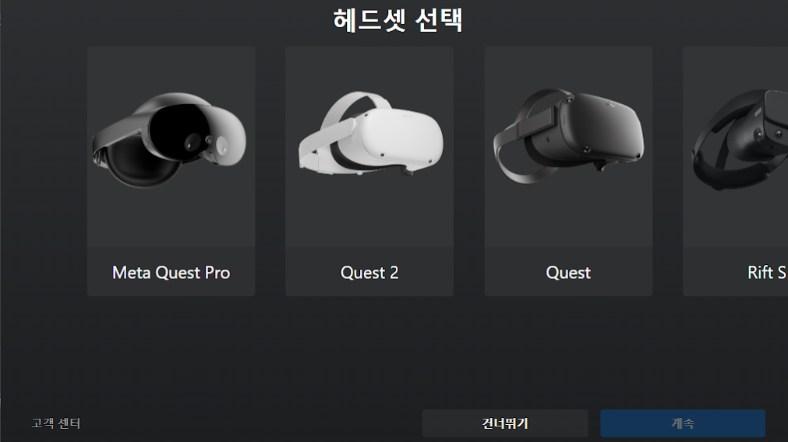
오큘러스 앱에서 기기- 헤드셋추가 - Quest 2선택- 계속 

---
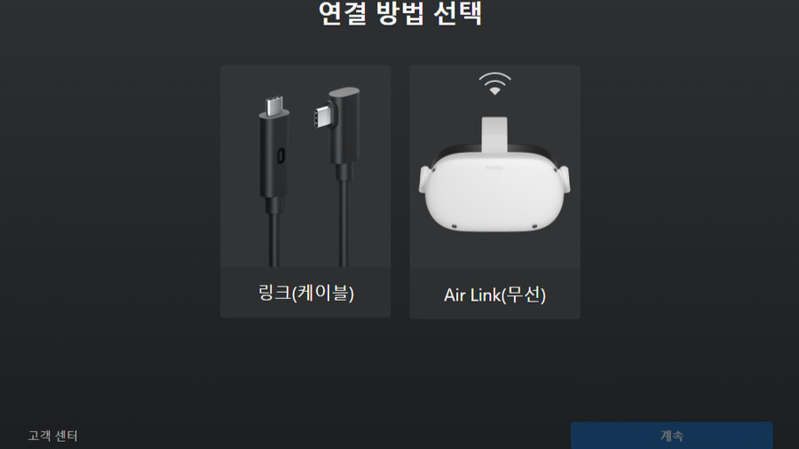
 링크(케이블)선택

---
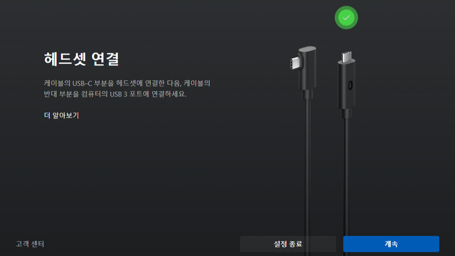
링크를 데스크탑(노트북)c타입에 꽂고 다른 하나는 오큘러스에 꽂으면 위에 화면처럼 연결됌

---

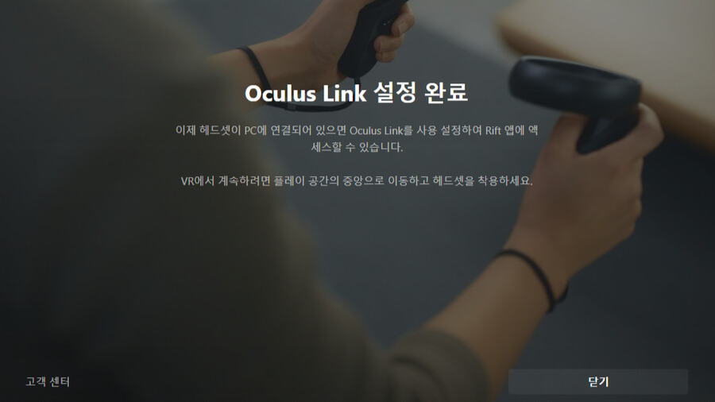
이런 화면이 뜨면 성공

---
### PC화면으로 연결(오큐러스)
홈- 환경 설정- 시스템 - Quest Link - Quest Link 실행-  
pc에서 뜨는 연결된 PC이름 클릭 후-실행

웹을 실행시킬라면 UI오른쪽에 +를 눌러 원하는 앱을
누르면 실행이 된다.

---
#### 알 수 없는 출처 

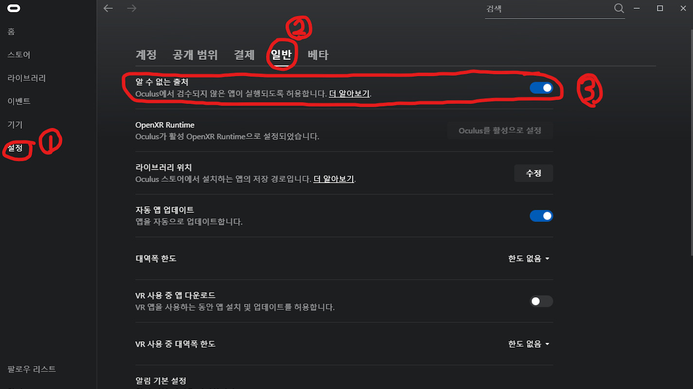
알 수 없는 출처로 연결불가 일떄 설정-일반- 알수없는출처를 켜두면 연결이 가능하다

---
### Quest link 나가는법

연결된 오큐러스 UI 맨 좌측에 vr기기 아이콘을 눌러 
나가면된다.

---
#### Hand Tracking 활성화 (자동)

----
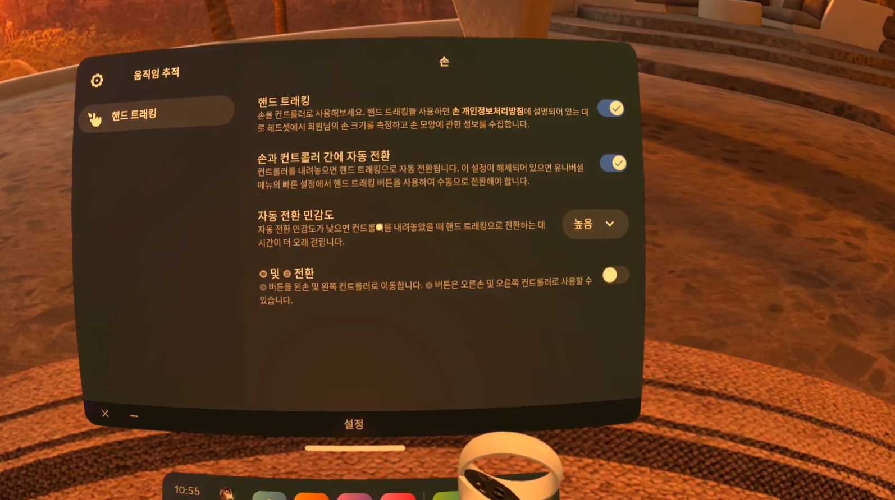
 [홈]- [환경설정]- [컨트롤러]- [핸드트래킹] 활성화,
  [민감도] 높음으로 설정후 
 핸드를 오큘러스에서 안보이게 둠(시간 2-3분정도걸림)
 

---
#### Hand Tracking 활성화 (수동)

만일 자동으로 원활하지않는다면 수동으로도 가능하다

---
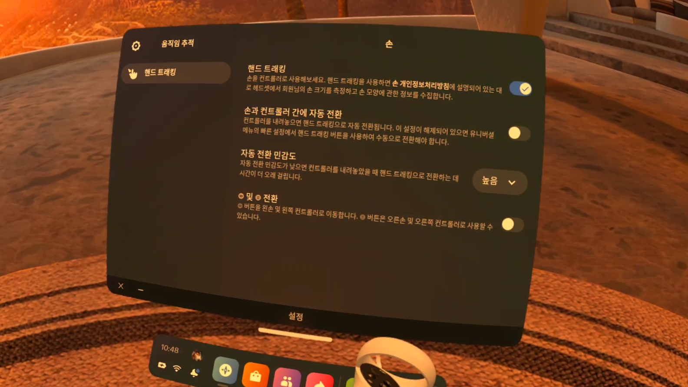
[홈]- [환경설정]- [컨트롤러]- [핸드트래킹]-[자동전환해제]

---
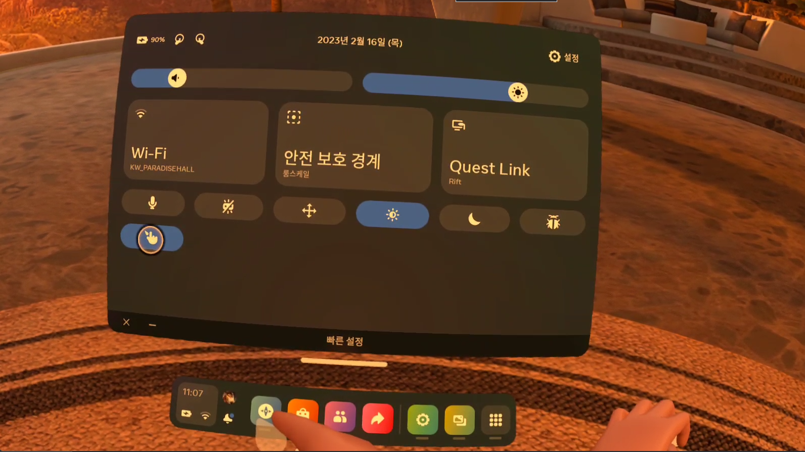

[홈]-[(우측)빠른설정]-[핸드트래킹]

---

### Oclus로 스크린샷 찍기

우측 핸드트리킹에서 o자 버튼를 누르고 검지부분을 누르면
 자동으로 오큐러스
스크린 샷이 가능하다

---
## pc로 보내는 방법 
{메인UI}-{파일}-(원하는 사진을 클릭)-{공유하기버튼 클릭}
{페이스북으로 메세지보내기}만 가능하다

---

### pc화면으로 Oclus화면 스크린샷
[side quest링크](https://sidequestvr.com/setup-howto)

---

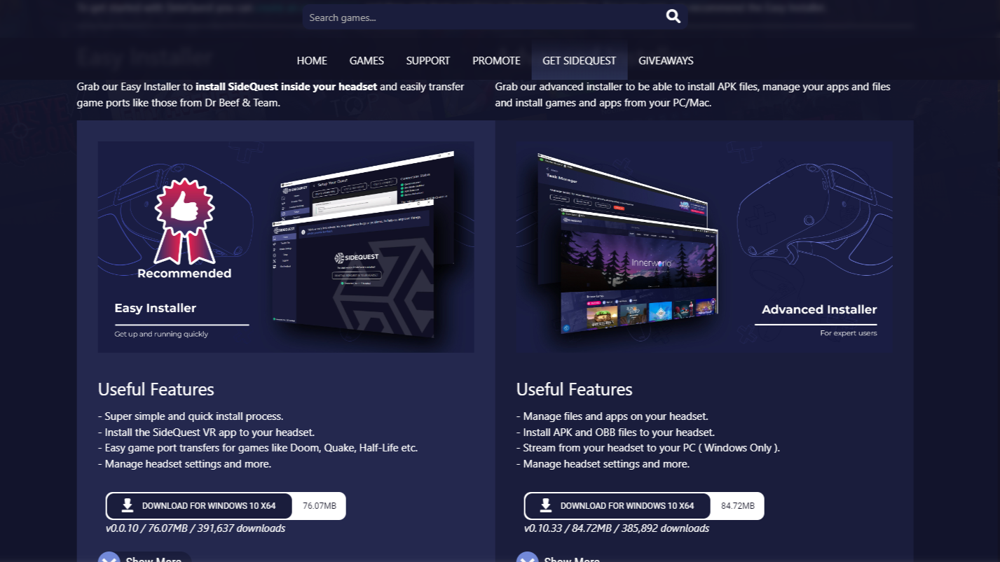
[Get SideQuest]-[Useful Features다운]

---

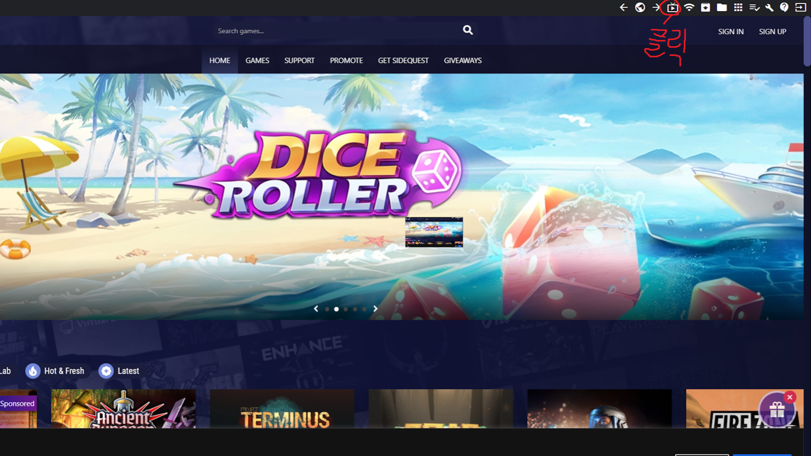
[다운로드 후]-[헤드셋(오큘러스)착용후]- {디버깅 허용}

---

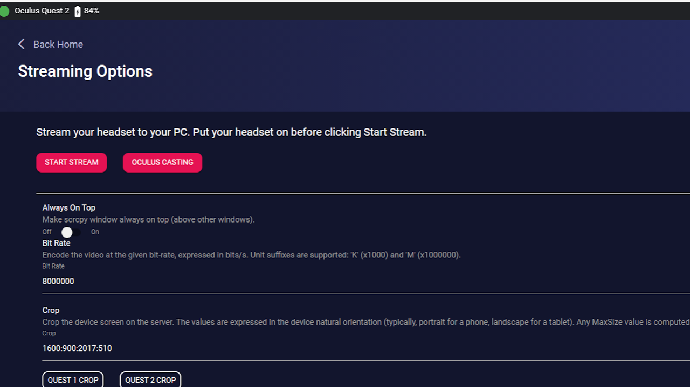
[START STREAM]클릭-[헤드셋을 써야 화면이 나옴]

---

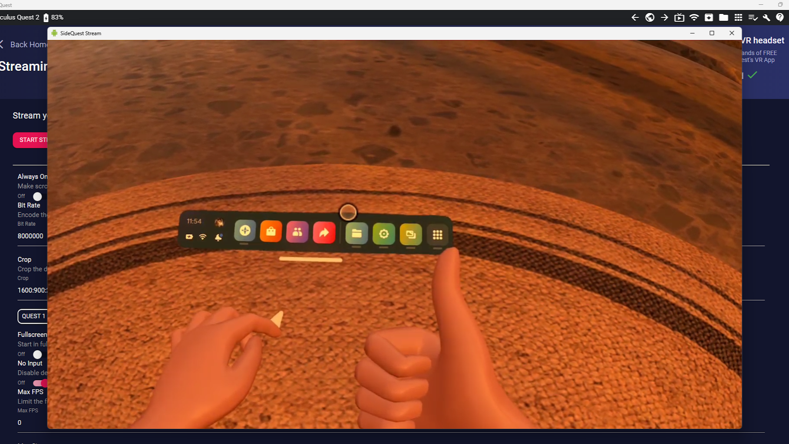
이런화면이 나오면 성공