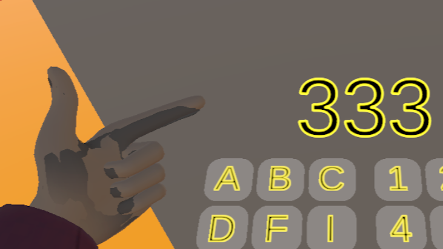

# 오큐러스와 PC(Unity)연결

---

 
오큐러스를 사용하기 위해 오큐러스 웹을 다운로드한다.
https://www.oculus.com/download_app/?id=1582076955407037

---
 
다운로드를 마치고 로그인을 진행한다 
(feacbook, instargram)

---
# PC와 연결(PC)

오큘러스 앱에서 기기- 헤드셋추가 - Quest 2선택- 계속 

---

 링크(케이블)선택

---

링크를 데스크탑(노트북)c타입에 꽂고 다른 하나는 오큘러스에 꽂으면 위에 화면처럼 연결됌

---

이런 화면이 뜨면 성공

---
# PC화면으로 연결(오큐러스)
홈- 환경 설정- 시스템 - Quest Link - Quest Link 실행-  
pc에서 뜨는 연결된 PC이름 클릭 후-실행

웹을 실행시킬라면 UI오른쪽에 +를 눌러 원하는 앱을
누르면 실행이 된다.

---
# 알 수 없는 출처 

알 수 없는 출처로 연결불가 일떄 설정-일반- 알수없는출처를 켜두면 연결이 가능하다

---
# Quest link 나가는법

연결된 오큐러스 UI 맨 좌측에 vr기기 아이콘을 눌러 
나가면된다.

---
# 컨트롤러 비활성화 하는 법

---

---

Unity 플레이 도중 핸드 컨트롤러없이 실제 손으로 동작이 가능하다  방법 같은 경우
PC와의 연결 차단 후, [홈]- [환경설정]- [컨트롤러]- [핸드트래킹] 활성화, [민감도] 높음으로 설정. 손을 인식하는데 시간이 조금 걸림. (약2-5 분 소요)

---
