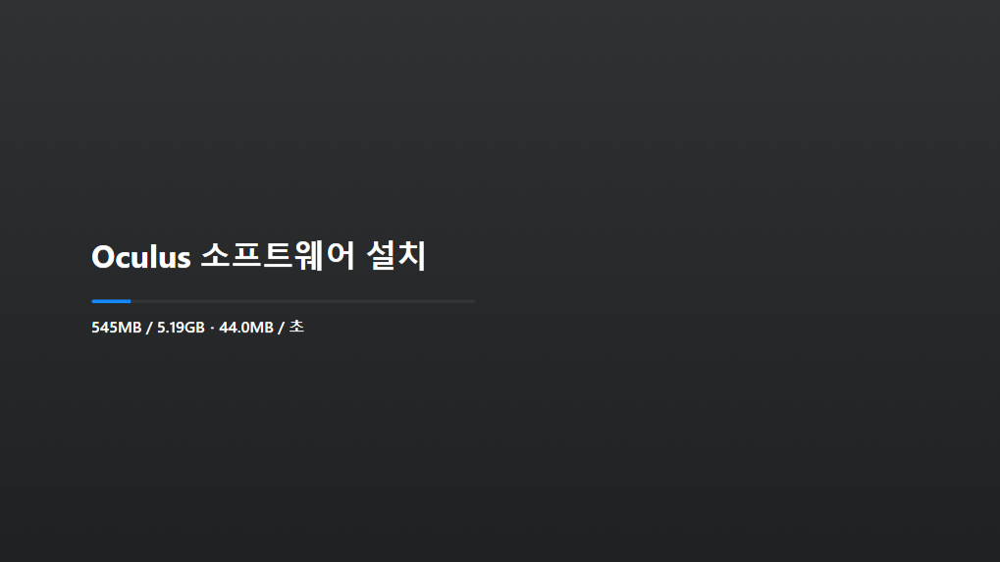
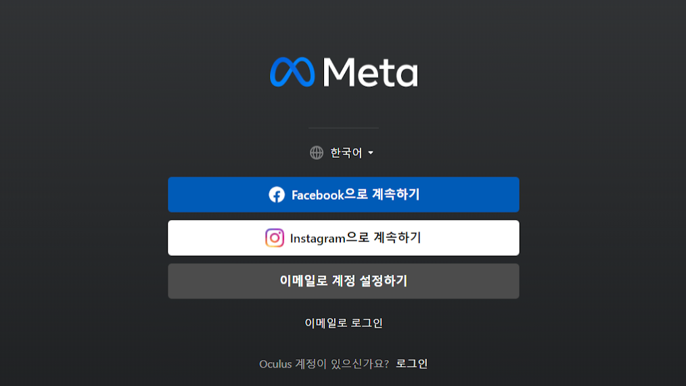

# 오큐러스링크, 메타링크 연결

---

 
오큐러스를 사용하기 위해 오큐러스 웹을 다운로드한다.
https://www.oculus.com/download_app/?id=1582076955407037

---
 
다운로드를 마치고 로그인을 진행한다 (feacbook, instargram)

---

---

*PC와 연결:
홈- 환경 설정- 맨 우측의 ‘PC연결’ 선택 ‘Rife’- 위젯이 뜨고 유니티 선택- 유니티 화면 나타남.  

*컨트롤러 비활성화 하는 방법 정리.
PC와의 연결 차단 후, [홈]- [환경설정]- [컨트롤러]- [핸드트래킹] 활성화, [민감도] 높음으로 설정. 손을 인식하는데 시간이 조금 걸림. (약2-5 분 소요)
---
