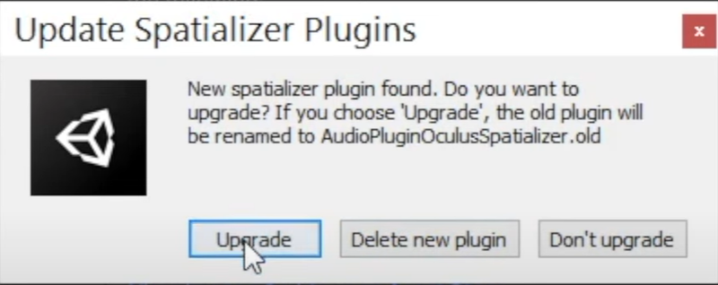
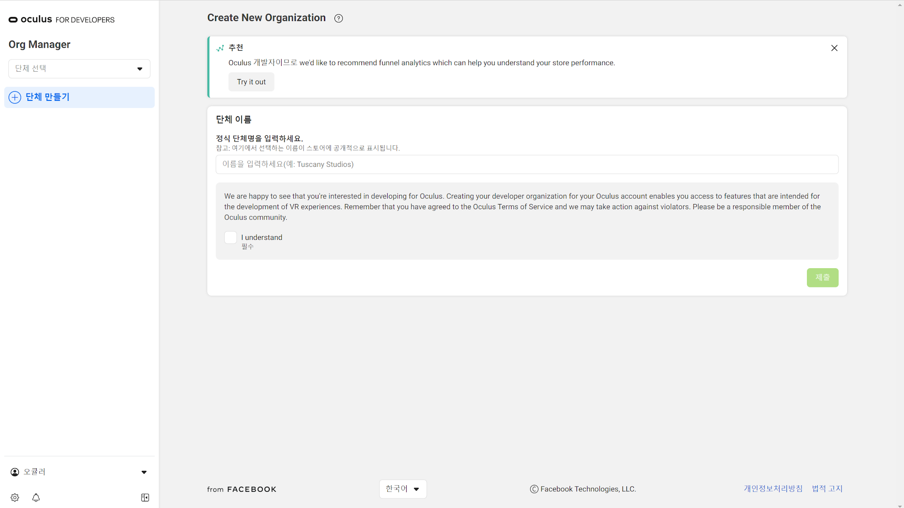

<!--_color: pink-->
# Unity VR Programming

---

# 목차
* 오큘러스 간단한 용어 설명

*  캐릭터 모델링 Unity로 import

* 

---

# 오큘러스 간단한 설명

*  VR(가상현실): 현실과는 다른 가상세계에서 실제같은 경험을 느낄 수 있는 기술
* Oculus link: 케이블을 통해 PC와 연결할 수 있는 기능(PC VR모드로 전환)
*  PassThrough: 고글에 탑재된 카메라를 통하여 주변환경을 흑백으로 송출해주는 기능
*  Chrome Cast: 폰, 탭, 노트북, VR 등 다양한 디스플레이 기기들을 TV로 송출 수있도록 도와주는 하드웨어 기기
*  Oculus Developer Hub: 오큘러스 퀘스트에서 앱을 개발하거나 라이브 스트리밍을 더 편리하게 사용할 수 있는 PC어플 
* 룸 스케일 경계 / 고정 경계: 오큘러스같은 VR을 사용하기 위해선 임시 공간

---

* Hand Tracking
핸드 트래킹은 오큘러스 고글에 탑재된 있는 4개의 카메라와 센서를 통하여 손을 감지기능
[핸드 트리킹 관련영상1](https://youtu.be/hX7GJfYmj7M?t=662)
[핸드 트리킹 관련영상2](https://www.youtube.com/watch?v=WELSs-lPJYA)
---

# TouchGrab(자유자재로 잡기 기능)

* game object(1)를 만들고 물건의 이름으로 변경.
* Touch hand Grab Interactable, Rigidbody, Grabbable, Physics Grabbable, Respawn On Drop을 추가.
* 그 안에 모델링 된 물건을 넣는다.
* 그리고 그 안에 game object(2)를 하나 더 만들어서 물건이름_collider 으로 변경.
---

game object(2)에
mesh filter을 추가하여 mesh에 cube를 넣고(mesh filter가 이미 있다면 넣지말것),
box collider을 추가하여 edit collider를 누르고(또는mesh collider 추가)

---

물건에 최대한 맞게 박스를 조정.

---

다시 game object(1)로 가서 
위 사진과 동일하게 설정한다. 
Touch Hand Grab Interactable - Pointable Element에 game object(1)을 드래그드롭

---
bounds collider에 game object(2)를 드래그드롭 
Grabbable - Transfer On Second Selection 체크
Physics Grabbable - Grabbable과 Rigidbody에 game object(1)드래그드롭
Respawn On Drop - 0.1로 설정
(만약 Rigidbody에 Use Gravity가 꺼져있다면 꼭 체크하기)

---
### Colliders 만들기 (HullPart)

 1. game object(2)는 잡을 수 있는 범위였다면 이번에 제작하는 것은 잡을 수        있는부위이다.
물건에 Mesh Collider을 추가.

2. Mesh Collider - Convex 체크
   물건에 부착되어 있는 부분(단추, 끈 등)도 잡는기능을 추가하고 싶다면 위 방법을 반복.

---
# 예시)

---

다시 game object(1)으로 돌아가서 
Touch Hand Grab Intereactable - Colliders 에서 
1. 물건 포함 파츠들의 총 수
2. Hierachy에서 HullPart들을 하나씩 드래그드롭
(만약 잡는 부분이 서로 다른위치에 있다면 touch hand grab interactable 
스크립트를 하나 더 추가하여 기능을 넣는다)

---
## 오류보완>collider가 충족되지 않을 경우

이 경우, Bounds Collider가 none 또는 Colliders가 none 이였기에 발생하는 
오류로, 게임이 전혀 작동되지 않는다.

---
## OVR Build - 빌드에서 핸드트래킹 기능이 작동되지 않는다면?

Hierachy - Headset(VR카메라) - OVR Camera Rig - Inspector - 내려가면 Quest Features - Hand Tracking Support - Controllers and Hands로 바꾸기

---
## Convex 오류

touch hand grab interactable을 추가하여  bounds collider와 colliders - element0 에 가방hierachy를 모두 넣는다.

---
## 담기는 기능을 넣는 방법

필요한 것: 오브젝트의 mesh와 모델링 파츠들

---

## 오브젝트가 잘 안잡히는 이유

* 사이즈가 너무 커서 잡는 범위 또한 커져서 어렵기 때문
* 범위를 작게 잡았기 때문에
* 등록한 '잡을  수 있는 부위'가 너무 작게 지정되었거나 부위의 콜라이더를 잘못 
설정했기 때문

---

## 잡기 기능 늘리기-ex))마스크

---
1. mask_collider 에 가장 위에 있는 콜라이더를 없앤다
2. mask - inspector - touch hand grab interactable - colliders - element +버튼누르고 추가 - mask_collider을 element3에 끌어넣는다

3. mask_collider (2)에서 is trigger 체크한다 - istrigger로 지정해 두면 모델링 부위까지 손이 닿고 잡아야 잡히는 자연스러운 기능을 넣을 수 있다.(안할 시 콜라이더 부분이 먼저 인식되어 손에 쉽게 밀려나가고 부자연스럽다)

---

# 트리거 기능(가방안에 물건 고정하기)

---

1. 가방오브젝트에 gameobject(이름:collider) 
2. rigidbody추가에 IsKinematic체크하고, box_collider을 가방내부에 맞춰 생성하고 IsTrigger 체크를 한다.(가방의 모델링이 박스가 아닌 다른 유형을 갖고 있다면 가방 내부 모델링을 받아 콜라이더로 지정하거나 전반적인 사이즈로 지정하나 들어간 사물들이 가방을 뚫고 있을 수 있다)

---
3. 스크립트 BagInScript를 생성한다.(Teams 파일에 업로드됨)
Card_collider에는 들어갈 사물의 collider, Card_g에는 사물(gameobject), In_target에는 가방, Out_target에는 사물의 부모를 지정한다.
4. 물건이 plane 부분에 가까우면 리스폰되기 때문에 plane을 낮추거나 수치를 조정해야한다
* 가방안에 물건이 들어갈 시 parent가 정상적으로 작동되지만 들어가있는 물건은 잡기기능이 비활성화되어있다. 
5. 콜라이더 작용으로 인해 손으로 물건을 들어올릴 시 'card out bag!' 로그가 뜨며 잡기기능이 정상작동 된다.
(OnTriggerExit:b_l_() - 손으로 가방에 상호작용을 할 때 마다 로그가 뜨는 현상이 있다.)

---

# 오큘러스 퀘스트2 세팅 + 핸드 트래킹 절차 안내

---

## [유니티 허브 다운로드(Download)](https://unity3d.com/kr/get-unity/download)
* Unity Hub 다운로드 클릭 → UnitySetup 설치

---

# 유니티 버전 설치

2020.3.32f1 버전 설치 (상위 버전 설치를 가능하나 버전을 맞추는 게 좋음)

---

---
(예시사진)

1. 플랫폼(PLATFORMS)에서
 Android Build Support, Android SDK & NDK Tools, OpenJDK 선택하기 
 2.  계속(Continue)

3. 약관 동의 → 설치

---
# ※ 해당 버전이 없을 경우

<a target="_blank" href="https://github.com/whj11201/whj11201.github.io/blob/main/Unityinstalls.md">해당 폼랫폼이 없을시 방법</a> 

---

# VR 프로젝트 생성

1. 유니티 허브(Unity Hub) 메인 창
2. 좌측 메뉴바의 프로젝트 클릭
3. 새 프로젝트(New project)
4. VR (템플릿 없을 경우 템플릿 다운로드 클릭)
5. 프로젝트 이름(Project Name)
6. Basic VR  →위치(Location) 
7. 파일 위치는 원하는 곳에 지정
8. 프로젝트 생성(Create Project) 

 ---
 
# 프로젝트 생성 후

1. Project > Assets > Scene 으로 이동 → 우클릭 → Create → Scene 생성(이름은 VR Basic)

2. 더블클릭하여 씬(Scene) 들어가기

---

3. VR Basic 씬(Scene) 
4. 3D Object 
5. Plane 생성하기

---

 6. Hierarchy창에 Main camera 삭제(Delete)
7. Project창에 grid 검색 후 창에 보이도록 세팅 

---
## Oculus Integrations 설치

1. Window에서 Asset Storer

---

2. [Oculus integration 검색](https://assetstore.unity.com/?q=Oculus%20Integration&orderBy=1)

---

3. Oculus integration 클릭 
4. 에셋 다운로드(Asset download) 
5. Unity에서 열기(Open Unity)
6. 유니티 에디터 열기(유니티에서 Package Manager 실행)
(Sign in을 해야 다운로드 가능)

---

Oculus integration 클릭 → Download → Import

---

---

#### 알림창 - Yes > Cancel > Ok > Restart > Upgrade → 유니티 재시작 후 Import 완료

 ---
## 만약 알림창이 Upgrade가 아닌 경우

* Show Assets (Recommended)  > Delete Assets (Recommended) - Upgrade로 변경 완료 
 
 ---
 # VR 카메라 추가
 
 1. Project Scenes(꼭 VR Basic씬 안에서 검색해야 함) 
 2. OVRCameraRig 검색 → Hierarchy창에 드래그 
3. Headset으로 이름 변경

---
 
4. HeadSet 클릭 → OVR Manager (Script) → 
5. Tracking Origin Type - Floor Level 설정 →
6. Hand Tracking Support - Hands Only, Hand Tracking Frequency - MAX 로 설정

---
 
 # VR 핸드 추가

1. Project -Scenes - OVRHandPrefab 검색 

2. LeftHandAnchor, RightHandAnchor에 각각 OVRHandPrefab을 드래그하여 추가

---

  3. OVRHandPrefab 를 각각 LeftHand, RightHand로 이름 변경

  
  ---

4. LeftHand 클릭 → OVR Skeleton 스크립트  > Update Root Scale 체크
5.  Enable Physics Capsules 체크 
6. OVR Mesh 스크립트 > Mesh Type - Hand Left 설정

---

7. RightHand 클릭 → OVR Skeleton 스크립트  > Update Root Scale 체크, Hand Right 설정
8. Enable Physics Capsules 체크 
9. OVR Mesh 스크립트 > Mesh Type - Hand Right 설정

---

# Oculus Quest2 사이드퀘스트 설치 및 활성화

### 1. [오큘러스 개발자 계정 등록하기](https://developer.oculus.com/manage/organizations/create/)

---

---
* 단체 만들기 → 단체 이름 설정 →  I understand 체크하기 → 제출 클릭 → 동의함(개발자 비밀 유지 동의서) 클릭 → 제출
 
* 페이스북 로그인 아이디가 번호(본인 휴대폰)계정이 아닐 때, Oculus페이지 내에 번호 추가하기

---

# 오큘러스 퀘스트2(Android) 개발자 모드 활성화

Oculus 앱 → 메뉴 → 기기 → 개발자 모드 → 개발자 모드 ON

---
# 사이드퀘스트 설치

[링크](https://sidequestvr.com/download)