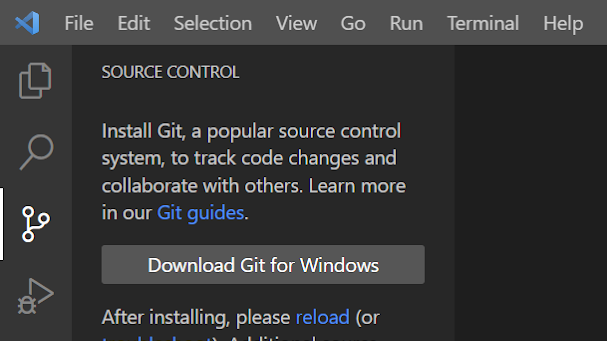
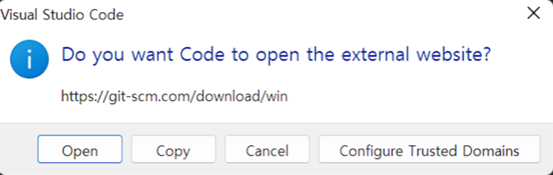
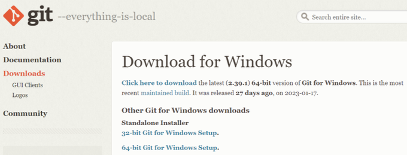
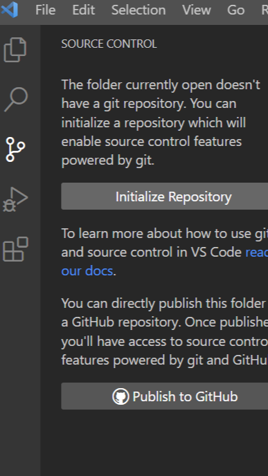

<!--_color: pink-->
## Visual studio code에 Github연결

---

* Visualstudiocode 열기
* 가지모양 아이콘 선택
* Download Git for Windows 클릭

---

open 클릭 하여 새 창이 열림 

---

Standalone 의 64bit Windows로 설치.
(추가로 따로 설치하는거 아닌 이상 next에 집중할것)
설치 완료 후 WisualStudio에서 reroad 글씨(파란색) 클릭 해주기.

---

Initialize Repository 클릭 

