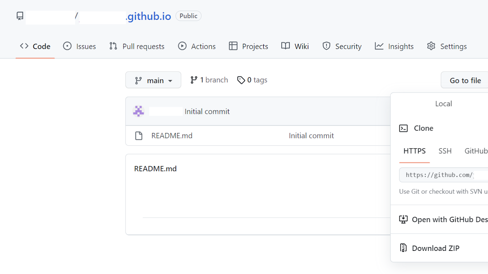
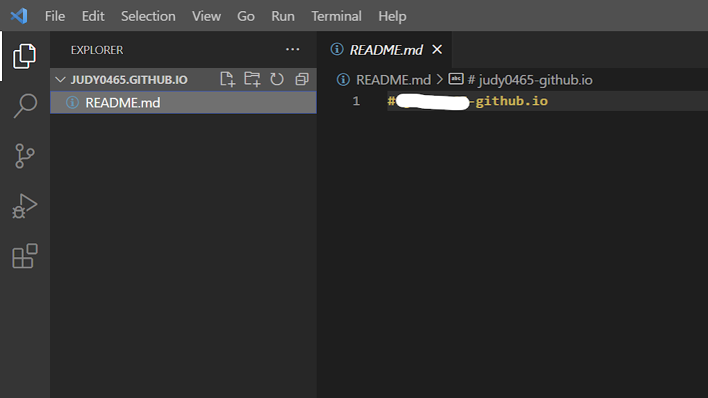
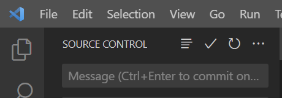
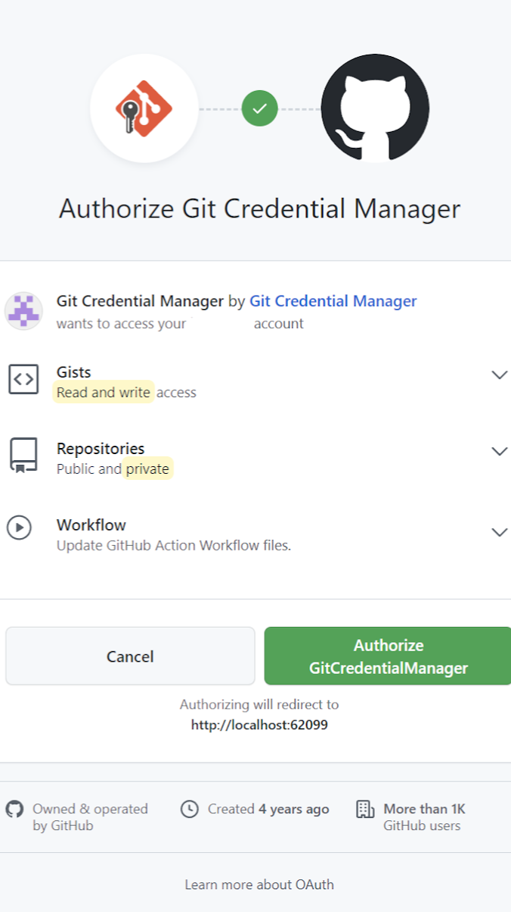
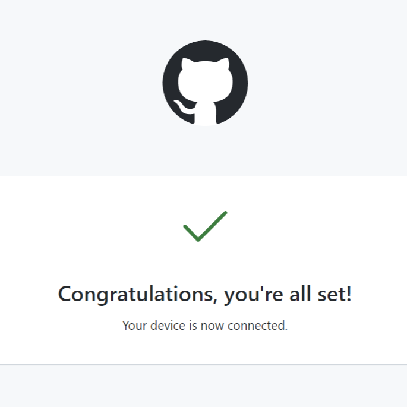
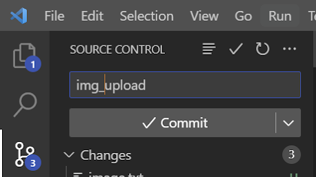

<!--_color: pink-->
## Visual studio code에 Github연결

---

* Visualstudiocode 열기
* 가지모양 아이콘 선택
* Download Git for Windows 클릭

---

open 클릭 하여 새 창이 열림 

---

Standalone 의 64bit Windows로 설치.
(추가로 따로 설치하는거 아닌 이상 next에 집중할것)
설치 완료 후 WisualStudio에서 reroad 글씨(파란색) 클릭 해주기.

---

Initialize Repository 클릭

---

Code 클릭해서 HTTPS 주소 복사하기
위치 폴더 명 'github.아이디' 형식으로 저장

---

메시지 창에 index.html 입력

---

브라우저 또는 코드로 로그인 선택 중,
'코드'로 로그인 선택. (더 시간이 단축되는 방법)
주어진 코드를 새 창에 코드 입력

---

(코드 입력 시 뜨는 화면)

---

Source Control 에 Commit이라고 뜨게 됨.

---
<!--_color: pink-->
## Commit 하기

---

Commit의 정의
새로운 내용을 업데이트 할 때 마다 사용됨. 

---

* 메지지 칸에 영어로 적어주고, (내가 업로드 하는 내용 간략히 요약하여 적기. 아무 내용이나 상관없음. ) 
* 'Commit' 버튼을 누르면 된다.

