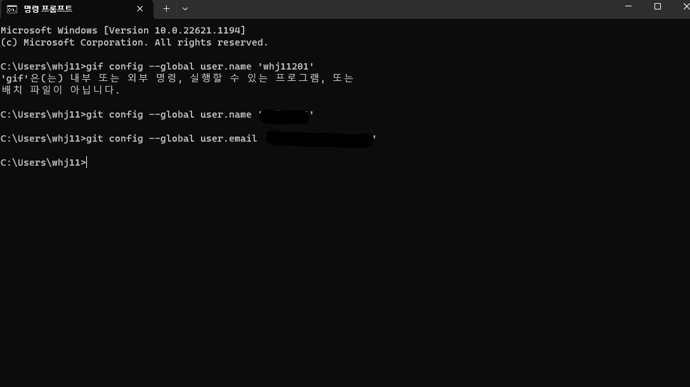

# 비쥬얼스튜디오 code에서 user이름이 없을시

---

---

 
 시작- cmd 검색 -명령 프롬프트 클릭

 ---

git config --global user.name 'test' 
git config --global user.email 'test@gmail.com'

---

user.name까지 적을 것( 띄어쓰기도 포함) 'test'에서 본인 아이디입력
2번째 본인 이메일@gmail.com 쓰면 아래에 문구처럼 뜸