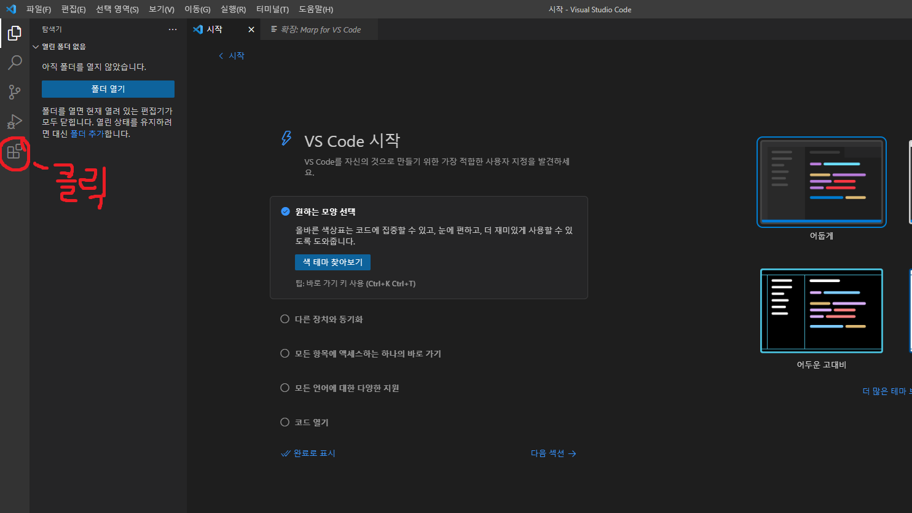
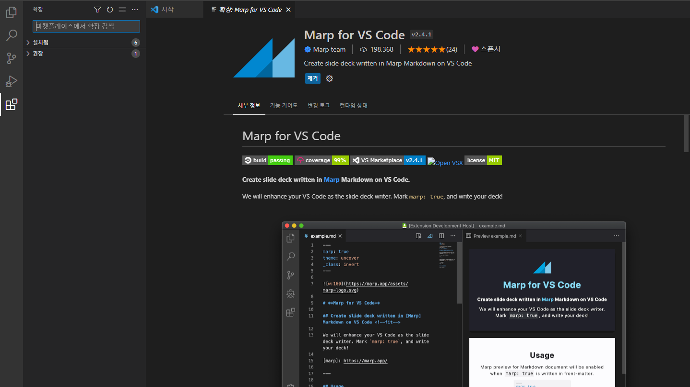
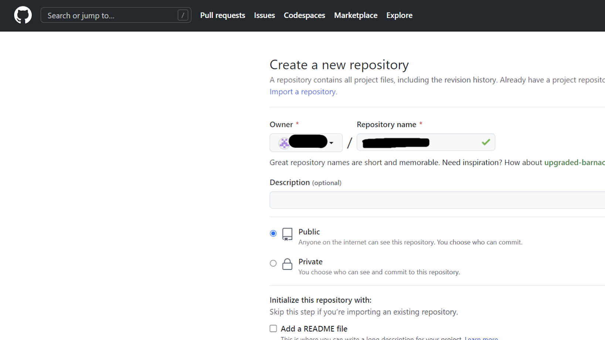
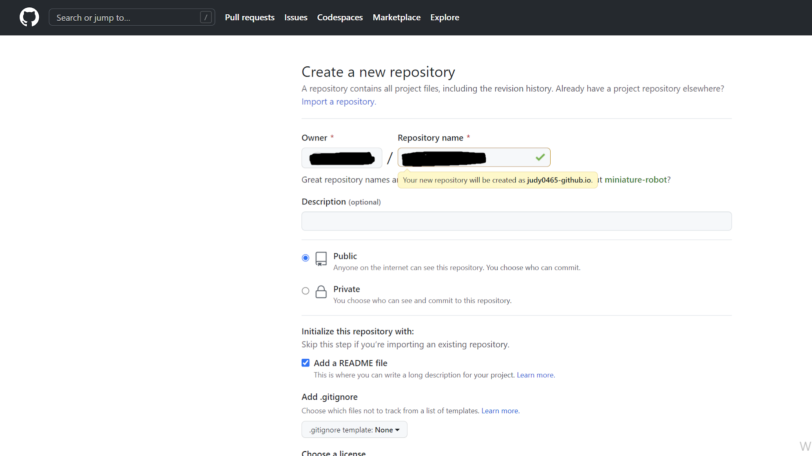

<!--_color: pink-->
# Vs code에 Marp 설치

---
 
Vscode킨 다음 시작화면에서 확장을 클릭

---
 
검색창에 marp를 검색하여 설치

---
<!--_color: pink-->
# Github 세팅
(Repository 생성)

---
-github.com으로 접속하여 로그인 후 New 버튼클릭
[링크](https://github.com/)

---
 
New 버튼을 눌러 새로 만든다.

---
 
readme 선택 후 만들기
위의 'settings' 선택- 왼쪽 열의 'pages' 선택 

---
Github pages 에서 Branch 를 none에서 'main'으로 변경
변경 후 레파지토리 생성.
(추가로 아이디에 -가 있으면 작동이 안되므로 
다시 아이디를 만드는걸 추천함)

