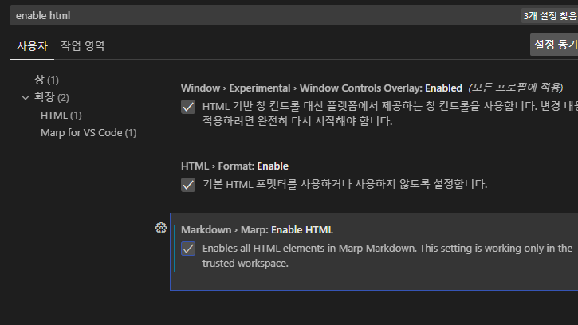
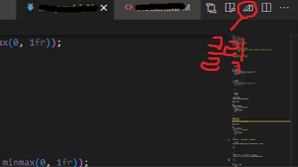

<!--_color: skyblue-->
 # Marp Tutorial 과정


 ---
# Code


```thml

{```python
def add(a, b):
  """A super helpful function!"""
  return a + b
  ```}

```

```python
def add(a, b):
  """A super helpful function!"""
  return a + b
  ```


  ---

  # Math
 ```thml

 한줄 표현
$\mathcal{0}(n\log{n})$

다중 표현

$$
\begin{align}
 x &= 1 + \frac{1}{2}\\
   &= 1.5
   \end{align}
   $$
```

---

###### 예시
한줄 표현
$\mathcal{0}(n\log{n})$

다중 표현

$$
\begin{align}
 x &= 1 + \frac{1}{2}\\
   &= 1.5
   \end{align}
   $$


 ---
 ### 이미지 좌측 설정 및 추가목록

 ```thml


 *1
 *2


 ```
---
 ###### 이미지 좌측 설정 및 추가목록
 

 * 1
 * 2

---
## Color 추가
```thml
 <!--_color: red-->
      폰드색상
 <!--_backgroundColor: black-->
      배경 색상
 # 넣고싶은 문구
```
---
### 예시
 <!--_color: SKYBLUE-->
 <!--_backgroundColor: green-->
 ```css
 <!--_color: SKYBLUE-->
 <!--_backgroundColor: green-->
 ```

 ---

 ## 텍스트 좌우 배치

설정-설정-enable html검색 확인-체크

---
````html
style: |
    .columns {
        display: grid;
        grid-template-columns: repeat(2, minmax(0, 1fr));
        gap: 1rem;
    ---

 <div class="columns">
 <div>

 * a
 * b
 * c
 </div>

 <div>

 * d
 * e
 * f
 </div>
 </div>


 ---
 }


````

---
### 예시
 <div class="columns">
 <div>

 * a
 * b
 * c
 </div>

 <div>

 * d
 * e
 * f
 </div>
 </div>


 ---
 # 적용 실패 사례

---


적용안됨
```css
style: |
 .columns {
    display: grid;
    grid-template-colums: repeat(2, minmax(0, 1fr));
    gap: 1rem;
 }
```
적용됨
```css
 style: |
    .columns {
        display: grid;
        grid-template-columns: repeat(2, minmax(0, 1fr));
        gap: 1rem;
    }
  
```
 ---
 
## PDF로 생성


export slide deck 클릭
자기가 원하는 파일 위로 export를 눌러 생성

---

[참고:Youtube](https://www.youtube.com/@dougmercer)
Thanks you
  